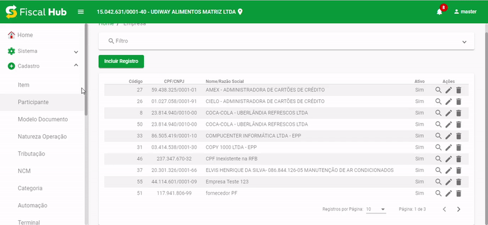
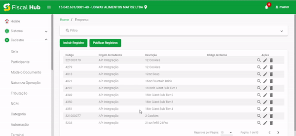

Exemplo para telas que possuem um grid principal

## Grid com Novo Estilo



### Code
```html
<div class="animated fadeIn">
  <div fxLayout="column" class="div-table-principal">
    <ng-template #loadingScreen>
      <mat-progress-spinner mode="indeterminate" style="margin:0 auto;" [strokeWidth]="1" [diameter]="32" [color]="'green'"></mat-progress-spinner>
    </ng-template>
    <mat-card *ngIf='dataSource; else loadingScreen;'>
      <div fxLayout="row">
        <button *hasPermission="[false, [1],[2]]" mat-raised-button color="primary" id="botao-novo-registro"
          (click)="openModal(empresaSelecionada, 'I');">Incluir
          Registro</button>
        <span style="flex: 1 1 auto;"></span>
        <app-filter-table (limpar)="limpar()" (pesquisa)="pesquisa({pageSize : this.registroPorPagina, length : 1, pageIndex : 0})">
          <div fxLayout class="sb-container content-space-between">
            <mat-form-field fxFlex="20">
              <input [defaultValue] mask="00.000.000/0000-00" autocomplete="off" specialCharacters="false" type="text"
                id="cnpj" matInput placeholder="CNPJ" [value]="!!empresaFiltro?.cnpj ? empresaFiltro?.cnpj : ''"
                (input)="empresaFiltro.cnpj = $event.target.value" [formControl]="cnpjFiltroFormControl">
            </mat-form-field>
            <mat-form-field fxFlex>
              <input [defaultValue] trim="blur" type="text" autocomplete="off" id="razaoSocial" matInput placeholder="Razão Social"
                maxlength="150" [value]="!!empresaFiltro?.razaoSocial ? empresaFiltro?.razaoSocial : ''" (input)="empresaFiltro.razaoSocial = $event.target.value"
                [formControl]="razaoSocialFiltroFormControl">
            </mat-form-field>
            <mat-form-field fxFlex>
              <input [defaultValue] trim="blur" type="text" autocomplete="off" id="descricao" matInput placeholder="Fantasia"
                maxlength="150" [value]="!!empresaFiltro?.fantasia ? empresaFiltro?.fantasia : ''" (input)="empresaFiltro.fantasia = $event.target.value"
                [formControl]="fantasiaFiltroFormControl">
            </mat-form-field>
          </div>
        </app-filter-table>
      </div>
      <table mat-table #table [dataSource]="dataSource" class="table table-responsive table-striped table-hover">
        <ng-container matColumnDef="cnpj">
          <th mat-header-cell *matHeaderCellDef style="text-align: center;"> CNPJ </th>
          <td mat-cell *matCellDef="let empresa" style="text-align: center;"> {{empresa.cnpj |
            cnpjCpfMask}} </td>
        </ng-container>

        <ng-container matColumnDef="razaoSocial">
          <th mat-header-cell *matHeaderCellDef> Razão Social </th>
          <td mat-cell *matCellDef="let empresa"> {{empresa.razaoSocial}} </td>
        </ng-container>

        <ng-container matColumnDef="fantasia">
          <th mat-header-cell *matHeaderCellDef> Nome Fantasia </th>
          <td mat-cell *matCellDef="let empresa"> {{empresa.fantasia}} </td>
        </ng-container>

        <ng-container matColumnDef="acao">
          <th mat-header-cell *matHeaderCellDef> Ações </th>
          <td mat-cell *matCellDef="let empresa">
            <button mat-icon-button *hasPermission="[false,[1],[1]]" class="table-action hover-yellow" data-toggle="modal"
              (click)="openModal(empresa, 'A', 1);">
              <mat-icon id="Visualizar" matTooltip="Visualizar" data-toggle="modal">search</mat-icon>
            </button>
            <button mat-icon-button *hasPermission="[false,[1],[3]]" class="table-action hover-yellow" data-toggle="modal"
              (click)="openModal(empresa, 'A', 3);">
              <mat-icon id="Editar" matTooltip="Editar" data-toggle="modal">mode_edit</mat-icon>
            </button>
            <button mat-icon-button *hasPermission="[false,[1],[4]]" class="table-action hover-danger" data-toggle="modal"
              (click)="confirmDelete(empresa);">
              <mat-icon id="Excluir" matTooltip="Apagar" data-toggle="modal">delete</mat-icon>
            </button>
          </td>
        </ng-container>

        <tr mat-header-row *matHeaderRowDef="displayedColumns"></tr>
        <tr mat-row *matRowDef="let row; columns: displayedColumns;"></tr>
      </table>
      <mat-paginator [length]="totalPagina" [pageSize]="registroPorPagina" [pageSizeOptions]="pageSizeOptions" (page)="pageEvent = $event;pesquisa(pageEvent);">
      </mat-paginator>
    </mat-card>
  </div>
</div>
```

## Grid no estilo antigo



### Code
```html
<div class="animated fadeIn">
  <mat-expansion-panel #filtroPanel>
    <mat-expansion-panel-header>
      <mat-panel-title>
        <mat-icon fxLayout fxLayoutAlign="center center" class="material-icons-cadastro" id="filter-search-icon">search</mat-icon>
        Filtro
      </mat-panel-title>
    </mat-expansion-panel-header>
    <div fxLayout fxLayoutAlign="space-between" fxLayoutGap="10px">
      <mat-form-field fxFlex>
        <input [defaultValue] autocomplete="off" specialCharacters="false" mask="00000" id="id" matInput placeholder="Código"
          [formControl]="idFiltroFormControl">
      </mat-form-field>
      <mat-form-field fxFlex>
        <input [defaultValue] trim="blur" type="text" autocomplete="off" id="descricao" matInput placeholder="Descrição"
          maxlength="80" [formControl]="descricaoFiltroFormControl">
      </mat-form-field>
      <mat-form-field fxFlex>
        <input [defaultValue] trim="blur" type="text" autocomplete="off" id="cst" matInput placeholder="CST" maxlength="4"
          [formControl]="cstFiltroFormControl">
      </mat-form-field>
      <mat-form-field fxFlex>
        <mat-select placeholder="Tipo Tributo" id="tipoTributo" class="mat-select-filtro" [formControl]="tipoTributoFiltroFormControl">
          <mat-option></mat-option>
          <mat-option *ngFor=" let tipoTributo of lstTipoTributo" [value]="tipoTributo.value">{{tipoTributo.viewValue}}</mat-option>
        </mat-select>
      </mat-form-field>
    </div>
    <div fxLayout fxLayoutAlign="flex-end">
      <button type="button" mat-stroked-button class="btn-filter" (click)="limpar();">Limpar</button>
      <button type="button" mat-flat-button color="primary" class="btn-filter" (click)="pesquisa({pageSize : this.registroPorPagina, length : 1, pageIndex : 0});">Pesquisar</button>
    </div>
  </mat-expansion-panel>

  <div fxLayout="column" class="div-table-principal">
    <div id="div-botao-novo">
      <button *hasPermission="[false, [9],[2]]" type="button" mat-raised-button color="primary" id="botao-novo-registro"
        (click)="openModal(fisTributacaoSelecionada, 'I');">
        Incluir Registro</button>
    </div>
    <ng-template #loadingScreen>
      <mat-progress-spinner mode="indeterminate" style="margin:0 auto;" [strokeWidth]="1" [diameter]="32" [color]="'green'"></mat-progress-spinner>
    </ng-template>
    <mat-card *ngIf='dataSource; else loadingScreen;'>
      <table mat-table #table [dataSource]="dataSource" class="table table-responsive table-striped table-hover">
        <ng-container matColumnDef="id">
          <th mat-header-cell *matHeaderCellDef> Código </th>
          <td mat-cell *matCellDef="let fisTributacao"> {{fisTributacao.id}} </td>
        </ng-container>

        <ng-container matColumnDef="descricao">
          <th mat-header-cell *matHeaderCellDef> Descrição </th>
          <td mat-cell *matCellDef="let fisTributacao">
            {{fisTributacao.descricao}} </td>
        </ng-container>

        <ng-container matColumnDef="tipoTributo">
          <th mat-header-cell *matHeaderCellDef> Tipo Tributo </th>
          <td mat-cell *matCellDef="let fisTributacao">
            {{fisTributacao.tipoTributo | tipoTributoMask}} </td>
        </ng-container>

        <ng-container matColumnDef="entradaSaida">
          <th mat-header-cell *matHeaderCellDef> Movimento </th>
          <td mat-cell *matCellDef="let fisTributacao">
            {{fisTributacao.entradaSaida | entradaSaidaMask}} </td>
        </ng-container>

        <ng-container matColumnDef="cst">
          <th mat-header-cell *matHeaderCellDef style="text-align: center;"> CST </th>
          <td mat-cell *matCellDef="let fisTributacao" style="text-align: center;">
            {{fisTributacao.tbFisCst.cst}} </td>
        </ng-container>

        <ng-container matColumnDef="csosn">
          <th mat-header-cell *matHeaderCellDef style="text-align: right;"> CSOSN </th>
          <td mat-cell *matCellDef="let fisTributacao" style="text-align: right;">
            {{fisTributacao.csosn}} </td>
        </ng-container>

        <ng-container matColumnDef="aliquota">
          <th mat-header-cell *matHeaderCellDef style="text-align: right;"> Aliquota </th>
          <td mat-cell *matCellDef="let fisTributacao" style="text-align: right;">
            {{fisTributacao.aliquota | number:'.2-2'}} </td>
        </ng-container>

        <ng-container matColumnDef="acao">
          <th mat-header-cell *matHeaderCellDef> Ações </th>
          <td mat-cell *matCellDef="let fisTributacao">
            <button mat-icon-button *hasPermission="[false,[9],[1]]" class="table-action hover-yellow" data-toggle="modal" (click)="openModal(fisTributacao, 'A', 1);">
              <mat-icon id="Visualizar" matTooltip="Visualizar" style="cursor: pointer;" data-toggle="modal">search</mat-icon>
            </button>
            <button mat-icon-button *hasPermission="[false,[9],[3]]" class="table-action hover-yellow" data-toggle="modal" (click)="openModal(fisTributacao, 'A');">
              <mat-icon matTooltip="Editar" style="cursor: pointer;" data-toggle="modal">mode_edit</mat-icon>
            </button>
            <button mat-icon-button *hasPermission="[false,[9],[4]]" class="table-action hover-danger" data-toggle="modal" (click)="confirmDelete(fisTributacao);">
              <mat-icon matTooltip="Apagar" style="cursor: pointer" data-toggle="modal">delete</mat-icon>
            </button>
          </td>
        </ng-container>
        <tr mat-header-row *matHeaderRowDef="displayedColumns"></tr>
        <tr mat-row *matRowDef="let row; columns: displayedColumns;"></tr>
      </table>
      <mat-paginator [length]="totalPagina" [pageSize]="registroPorPagina" [pageSizeOptions]="pageSizeOptions" (page)="pageEvent = $event;pesquisa(pageEvent);">
      </mat-paginator>
    </mat-card>
  </div>
</div>
```