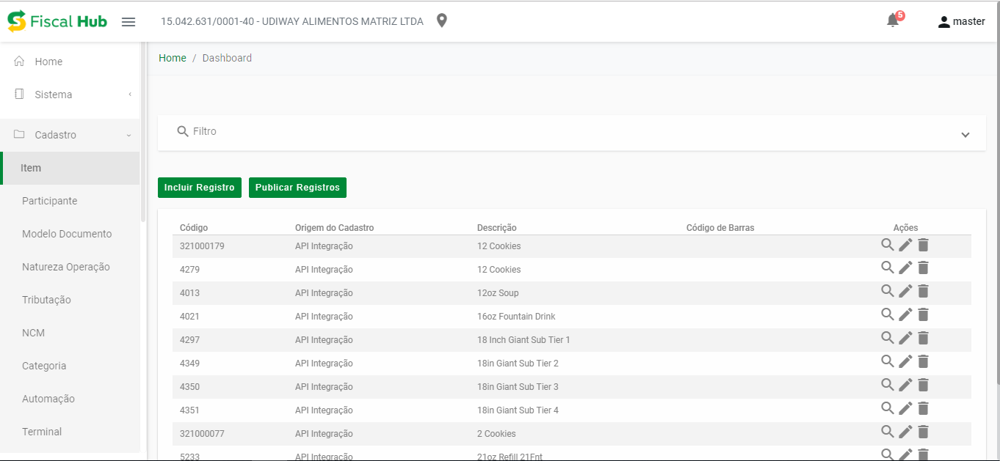
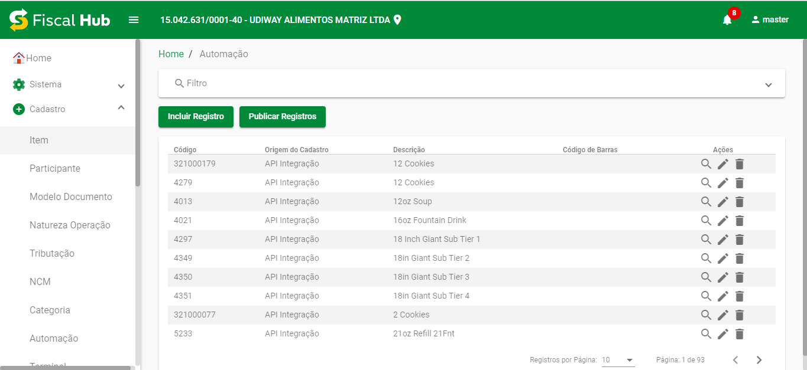
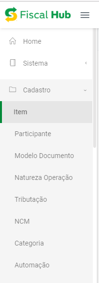
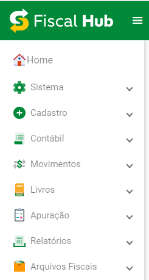

## Remoção do Bootstrap
<!--truncate-->

O [Bootstrap](https://getbootstrap.com/) foi completamente removido do projeto por motivos de performance e hoje utilizamos somente o [Angular Material](https://material.angular.io/) como framework de frontend.

## Refactoring 

Com a remoção do [Bootstrap](https://getbootstrap.com/) todo o sistema teve que passar por um atualização do código onde foi removido todas as classes do bootstrap e substituidos pelo [Angular Material](https://material.angular.io/). A grande diferença está na forma como o projeto será codificado (O que trouxe maior facilidade e agilidade.), porém, houve alguns ajustes visuais, além disso, tomei a liberdade de propor algumas melhorias nas telas:

### Tela Geral Antiga:

### Tela Geral Nova:
- A appbar ficou com fundo verde e um pouco maior.

### Sidenav Antigo:

### Sidenav Novo:
- O sidenav ganhou ícones novose também ficou um pouco maior.
>Lembrando que o Angular Material ainda não possui uma sidenav completa e por isso esta foi desenvolvida do 0.

## Ajustes Gerais
- Existiam alguns bugs de animação em alguns components que também foram corrigidos.